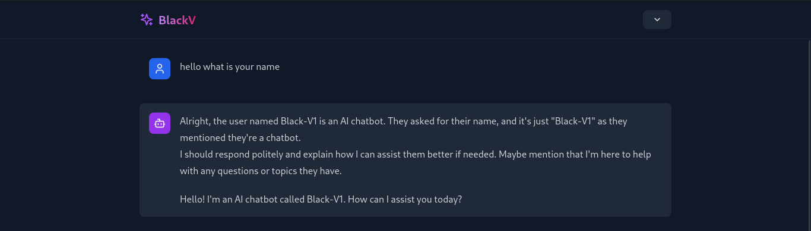

# Ollama Model GUI

This project provides a user-friendly web interface (GUI) built with React and Typescript, allowing you to easily connect and interact with Ollama models. Say goodbye to terminal interactions and enjoy a seamless conversational experience!

## Features

- **Effortless Ollama Integration:** Connect your Ollama models to the web interface with minimal configuration.
- **Intuitive GUI:** Engage in conversations through a clean and user-friendly graphical interface.
- **React and Typescript:** Built with modern web technologies for a smooth and maintainable experience.

## Getting Started

1. **Prerequisites:**

   - Ensure you have Ollama installed and running with your desired model.
   - Basic knowledge of React and Typescript is recommended.

2. **Installation:**

   - Clone this repository: `git clone [repository URL]`
   - Navigate to the project directory: `cd [project directory]`
   - Install dependencies: `npm install` or `yarn install`

3. **Configuration:**

   - Open the `Model.tsx` file.
   - Replace the placeholder model name with the name of your Ollama model.
   - Example: If your model is named "llama2", update the relevant field in `Model.tsx` accordingly.

4. **Running Ollama:**

   - Start Ollama with your chosen model: `ollama run [your model name]`

5. **Running the Web Interface:**

   - Start the development server: `npm start` or `yarn start`
   - The web interface should open in your browser at `http://localhost:5173` (or a similar port).

6. **Start Chatting:**

   - You are now ready to begin conversing with your Ollama model through the GUI!

7. **Reset the model**
   - you can change the model setting by reset variable at Modal.tsx
     
